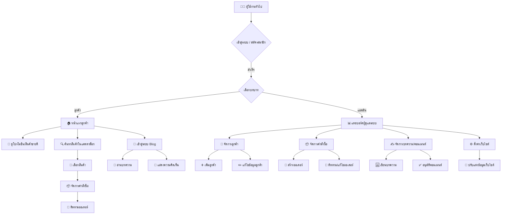

# BannyaApp

## ภาพรวมโครงการ

BannyaApp คือเว็บแอปพลิเคชันที่พัฒนาด้วย Laravel และ Filament ซึ่งออกแบบมาเพื่อปรับปรุงการจัดการการดำเนินงานทางธุรกิจต่างๆ ให้มีประสิทธิภาพยิ่งขึ้น โดยมีส่วนต่อประสานผู้ดูแลระบบที่ใช้งานง่ายสำหรับการป้อนข้อมูล ดูข้อมูล และจัดการข้อมูล รวมถึงระบบสำหรับผู้ใช้งานทั่วไปในการเข้าถึงข้อมูลสินค้าและบทความต่างๆ

## คุณสมบัติหลัก

| โมดูล               | รายละเอียด                                            |
| ------------------- | ----------------------------------------------------- |
| 🏠 **หน้าแรก**      | Hero Banner โปรโมชั่นรายสัปดาห์ + สินค้าขายดี         |
| 🔐 **ระบบสมาชิก**   | ลูกค้า / แพทย์ / พนักงาน (role-based)                 |
| 🛒 **สินค้า**       | หมวดหมู่ยา, ตัวกรอง (ใบสั่งยา/ไม่ใช้), สต็อกเรียลไทม์ |
| 💳 **ชำระเงิน**     | PromptPay QR + บัตรเครดิต (Stripe)                    |
| 📦 **จัดส่ง**       | Flash / Kerry + Tracking Number                       |
| 📝 **ใบสั่งยา**     | อัปโหลดไฟล์ / ถ่ายรูป → ตรวจสอบผ่านระบบ               |
| 📊 **แดชบอร์ด**     | ยอดขาย, สต็อกต่ำ, คำสั่งซื้อรอจัด                     |
| 🧑‍⚕️ **บทความสุขภาพ** | Blog + Comment (approve ก่อนแสดง)                     |
| 📱 **Line OA**      | แจ้งเตือนออเดอร์, ติดตามสถานะ                         |
| ⚙️ **ตั้งค่า**      | ค่าจัดส่ง, ภาษี, QR PromptPay, โลโก้                  |

- **หน้าแรก:** แนะนำบ้านยา โปรโมชั่น และสินค้าขายดี
- **ระบบยืนยันตัวตน:** สำหรับลูกค้าและผู้ดูแลระบบ (เข้าสู่ระบบ/สมัครสมาชิก)
- **แคตตาล็อกสินค้า:** ค้นหาและดูข้อมูลยา
- **การจัดการคำสั่งซื้อ (สำหรับลูกค้า):** สั่งซื้อ ติดตาม และจัดการออเดอร์
- **ระบบ Blog:**
    - แสดงบทความและข่าวสาร
    - ระบบคอมเมนต์สำหรับบทความ

- **แดชบอร์ด (สำหรับผู้ดูแลระบบ):** ภาพรวมยอดขายและสถิติ
- **การจัดการลูกค้า (สำหรับผู้ดูแลระบบ):** เพิ่ม แก้ไข ข้อมูลลูกค้า
- **การจัดการคำสั่งซื้อ (สำหรับผู้ดูแลระบบ):** จัดการออเดอร์และรายการคำสั่งซื้อ
- **การจัดการเนื้อหา (สำหรับผู้ดูแลระบบ):** จัดการบทความและอนุมัติคอมเมนต์
- **การตั้งค่าเว็บไซต์ (สำหรับผู้ดูแลระบบ):** ตั้งค่าร้านค้าทั่วไป
- **การจัดการข้อมูลหลัก (Master Data Management):**
    - บริษัทและสาขา
    - ข้อมูลภูมิศาสตร์ (จังหวัด, อำเภอ, ตำบล)
    - ข้อมูลที่เกี่ยวข้องกับสินค้า (หมวดหมู่, กลุ่มสินค้า, หน่วยนับ, ตัวเลือกการให้คะแนน, ข้อมูลคุณสมบัติ)
    - สถานะคำสั่งซื้อ

- **เอนทิตีทางธุรกิจหลัก (Core Business Entities):**
    - สินค้า
    - ลูกค้า

- **ข้อมูลธุรกรรม (Transactional Data Management):**
    - คำสั่งซื้อและรายการคำสั่งซื้อ
    - การรับสินค้าและรายการรับสินค้า
    - การจัดการสต็อก

- **ยูทิลิตี้สนับสนุน (Supporting Utilities):**
    - ข้อมูลติดต่อ
    - คูปอง
    - ช่องทางโซเชียล
    - QR Code Lines
    - รายการโปรด
    - คะแนนสินค้า

## เทคโนโลยีที่ใช้

- **Backend:** PHP 8.x, Laravel 10.x
- **Frontend:** Blade, Livewire, Alpine.js, Tailwind CSS, Vite, daisyui, Shadcn UI
- **Admin Panel:** Filament PHP
- **Database:** MySQL (หรือฐานข้อมูลที่เข้ากันได้)
- **การจัดการแพ็คเกจ:** Composer (PHP), npm/Bun (JavaScript)

## โครงสร้างเว็บเพจหลัก (รายละเอียด)

```
/
├── หน้าแรก
│   ├── แนะนำบ้านยา
│   ├── โปรโมชั่น
│   └── สินค้าขายดี
├── สินค้า
│   ├── หมวดหมู่สินค้า
│   ├── หน้ารายละเอียดสินค้า
│   │   ├── รีวิวและคะแนนสินค้า
│   │   ├── รายการสินค้าแนะนำ
│   │   └── เพิ่มลงตะกร้า
│   ├── ค้นหาและกรองสินค้า (ราคาช่วง, ยี่ห้อ, หมวดหมู่)
│   └── รายการโปรด (Favorites)
├── ตะกร้าสินค้า
│   ├── สรุปคำสั่งซื้อ
│   ├── การเลือกที่อยู่จัดส่ง
│   ├── การเลือกวิธีชำระเงิน
│   └── ยืนยันและชำระเงิน
├── บทความ (Blog)
│   ├── รายการบทความ
│   ├── หน้ารายละเอียดบทความ
│   │   ├── ระบบคอมเมนต์
│   │   └── แนะนำบทความที่เกี่ยวข้อง
├── เข้าสู่ระบบ / สมัครสมาชิก
│   ├── ฟอร์มเข้าสู่ระบบ
│   ├── ฟอร์มสมัครสมาชิก
│   ├── ลืมรหัสผ่าน / รีเซ็ตรหัสผ่าน
├── บัญชีผู้ใช้ (User Account)
│   ├── โปรไฟล์ส่วนตัว
│   │   ├── แก้ไขข้อมูลส่วนตัว (ชื่อ, อีเมล, รูปโปรไฟล์)
│   │   ├── เปลี่ยนรหัสผ่าน
│   │   └── ตั้งค่าการแจ้งเตือน
│   ├── รายการคำสั่งซื้อ
│   │   ├── รายละเอียดคำสั่งซื้อ
│   │   └── ติดตามสถานะคำสั่งซื้อ
│   ├── รายการโปรด
│   └── ที่อยู่จัดส่ง
│       ├── เพิ่ม/แก้ไข/ลบที่อยู่
├── หน้าช่วยเหลือ / FAQ
│   ├── คำถามที่พบบ่อย
│   ├── วิธีการใช้งานระบบ
│   └── ติดต่อฝ่ายบริการลูกค้า
├── หน้าติดต่อเรา
│   ├── ฟอร์มติดต่อสอบถาม
│   ├── ข้อมูลที่อยู่ เบอร์โทร อีเมล
│   └── แผนที่ (ถ้ามี)
```

---

```
/admin (Admin Panel - Filament)
├── แดชบอร์ด
│   ├── ภาพรวมยอดขาย
│   ├── สถิติผู้ใช้งาน
│   ├── รายงานสินค้าขายดี
│   └── แจ้งเตือนระบบ
├── จัดการสินค้า
│   ├── เพิ่ม/แก้ไข/ลบสินค้า
│   ├── หมวดหมู่สินค้า
│   ├── กลุ่มสินค้า
│   ├── หน่วยนับสินค้า
│   ├── คุณสมบัติสินค้า
│   └── สถานะสินค้า (เปิด/ปิดใช้งาน)
├── จัดการคำสั่งซื้อ
│   ├── รายการคำสั่งซื้อทั้งหมด
│   ├── ดูรายละเอียดคำสั่งซื้อ
│   ├── แก้ไขสถานะคำสั่งซื้อ
│   └── จัดการคูปองส่วนลด
├── จัดการลูกค้า
│   ├── เพิ่ม/แก้ไข/ลบข้อมูลลูกค้า
│   ├── ดูประวัติคำสั่งซื้อของลูกค้า
│   └── จัดการคะแนนสะสม/รายการโปรดลูกค้า
├── จัดการบทความและคอมเมนต์
│   ├── เพิ่ม/แก้ไข/ลบบทความ
│   ├── จัดการหมวดหมู่บทความ
│   └── อนุมัติ/ลบความคิดเห็น
├── ตั้งค่าเว็บไซต์
│   ├── ตั้งค่าร้านค้า (ชื่อ, โลโก้, ข้อมูลติดต่อ)
│   ├── ตั้งค่าช่องทางโซเชียล
│   ├── จัดการ QR Code Line
│   └── ตั้งค่าการแจ้งเตือนและอีเมลระบบ
├── จัดการข้อมูลหลัก (Master Data)
│   ├── บริษัทและสาขา
│   ├── ภูมิศาสตร์ (จังหวัด, อำเภอ, ตำบล)
│   ├── สถานะคำสั่งซื้อ
│   └── ตัวเลือกการให้คะแนนสินค้า
├── ระบบรายงานและสถิติ (Reports)
│   ├── รายงานยอดขาย
│   ├── รายงานสต็อกสินค้า
│   └── รายงานอื่น ๆ
├── จัดการผู้ใช้ระบบ (User Management)
│   ├── เพิ่ม/แก้ไข/ลบผู้ดูแลระบบ
│   └── กำหนดสิทธิ์การเข้าถึง
```

## Flow การทำงานของแอปพลิเคชัน (Mermaid Diagram)



## เริ่มต้นใช้งาน

ทำตามขั้นตอนเหล่านี้เพื่อตั้งค่าและรันโครงการบนเครื่องของคุณ:

### ข้อกำหนดเบื้องต้น

- PHP (แนะนำเวอร์ชัน 8.1 หรือสูงกว่า)
- Composer
- Node.js (แนะนำ LTS) หรือ Bun
- MySQL (หรือเซิร์ฟเวอร์ฐานข้อมูลที่เข้ากันได้)

### การติดตั้ง

```bash
# 1. Clone repository
 git clone https://github.com/your-username/bannyaapp.git
 cd bannyaapp

# 2. ติดตั้ง PHP dependencies
 composer install

# 3. ติดตั้ง JavaScript dependencies
 npm install    # หรือ bun install

# 4. ตั้งค่า environment
 cp .env.example .env
 php artisan key:generate

# 5. แก้ไขไฟล์ .env
# DB_DATABASE=bannyaapp_db
# DB_USERNAME=root
# DB_PASSWORD=

# 6. รัน migrations และ seeders
 php artisan migrate --seed

# 7. เชื่อมโยง storage
 php artisan storage:link
```

### การรันแอปพลิเคชัน

```bash
# เริ่มเซิร์ฟเวอร์ Laravel
php artisan serve

# คอมไพล์ frontend assets
npm run dev     # หรือ bun run dev
```

แอปพร้อมใช้งานที่: [http://127.0.0.1:8000](http://127.0.0.1:8000)

### การเข้าถึงผู้ดูแลระบบ Filament

เข้า `/admin` เช่น: [http://127.0.0.1:8000/admin](http://127.0.0.1:8000/admin)

สร้างผู้ใช้ผู้ดูแลระบบ:

```bash
php artisan make:filament-user
```

## การมีส่วนร่วม

ยินดีรับการมีส่วนร่วม! กรุณา fork, สร้าง branch และ pull request

## ลิขสิทธิ์

โครงการนี้อยู่ภายใต้ MIT License [MIT license](https://opensource.org/licenses/MIT)
